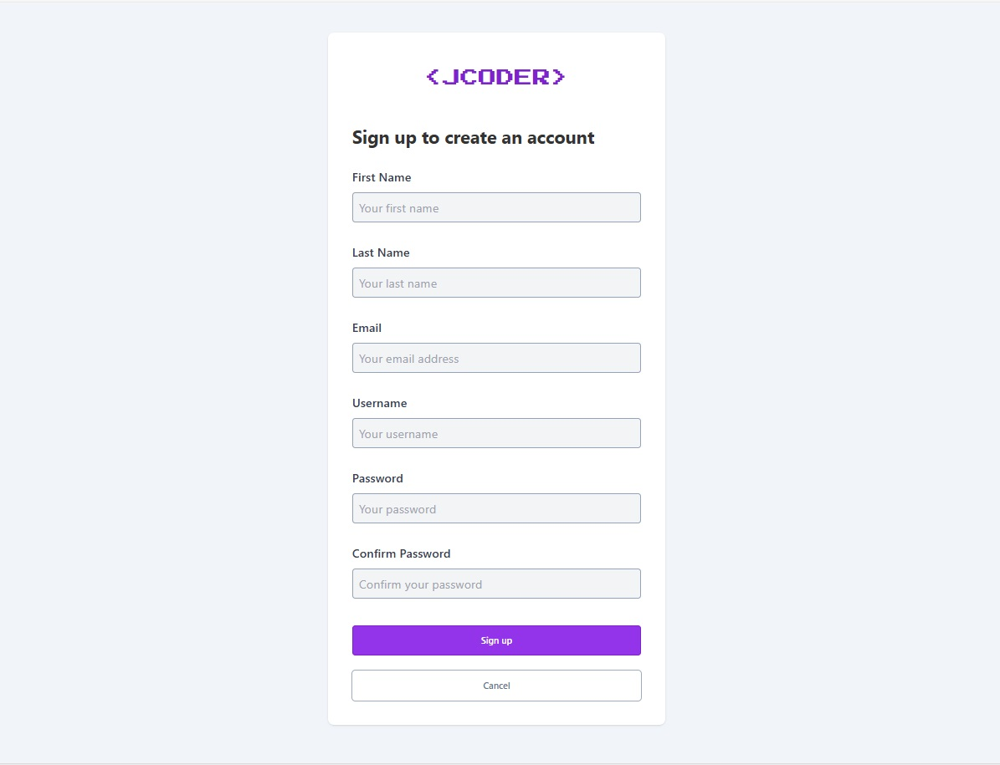
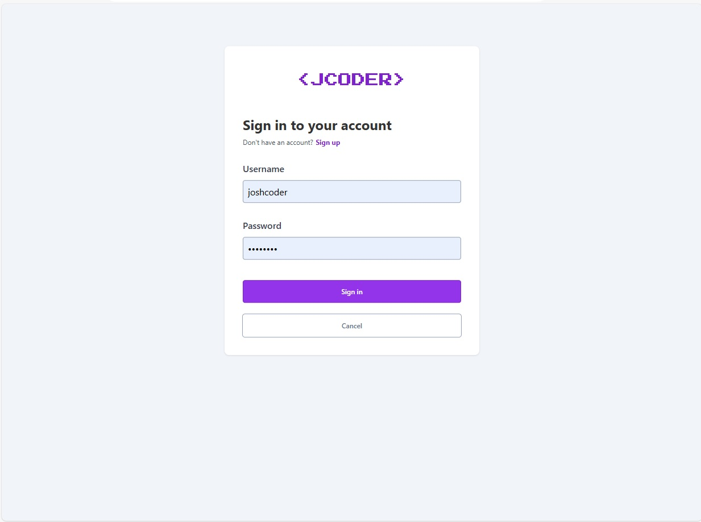
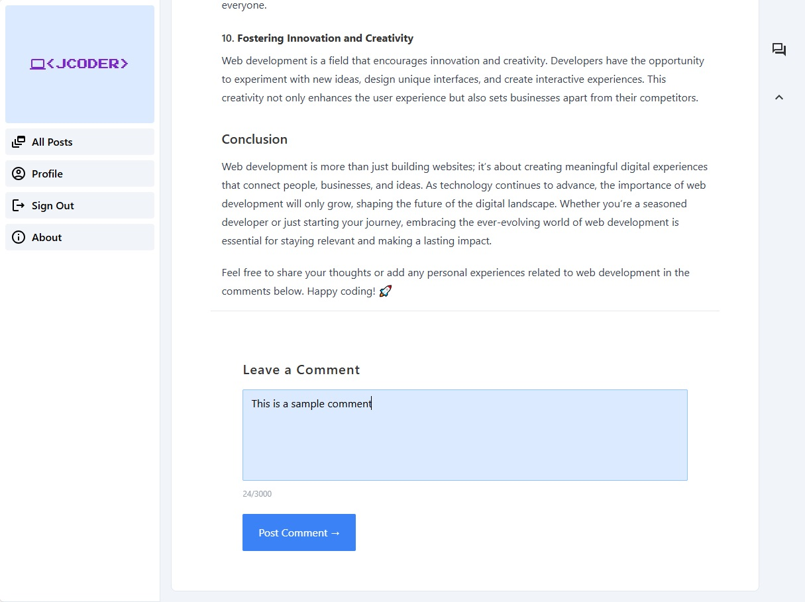
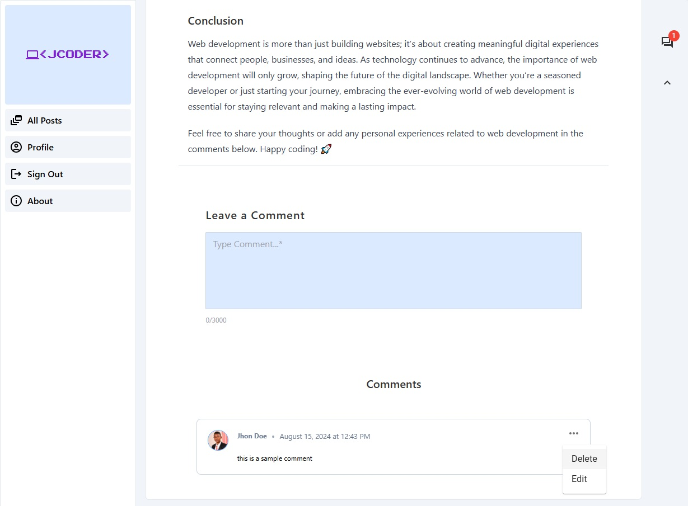
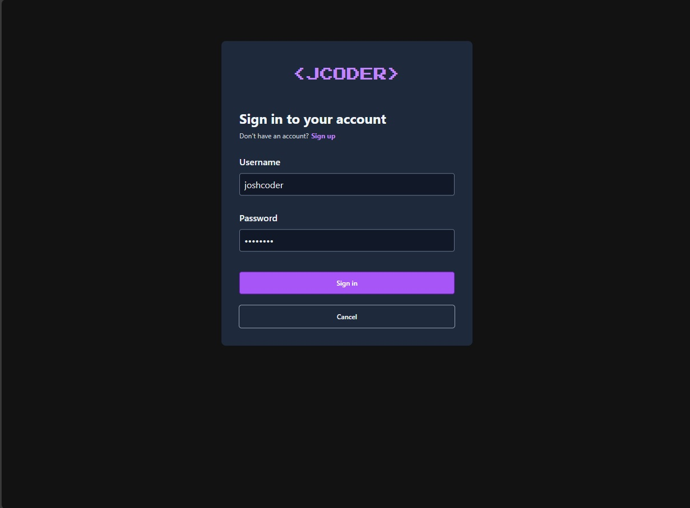
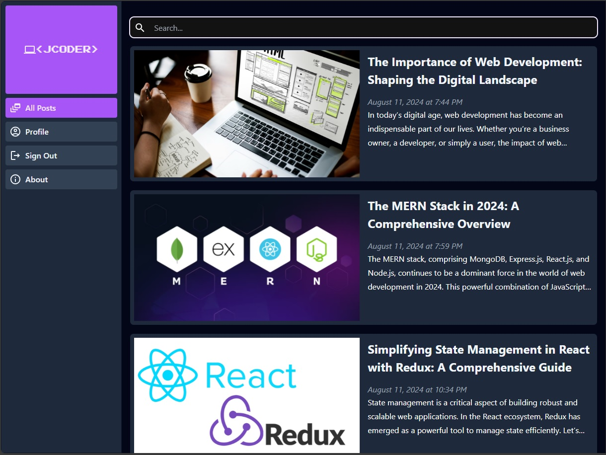
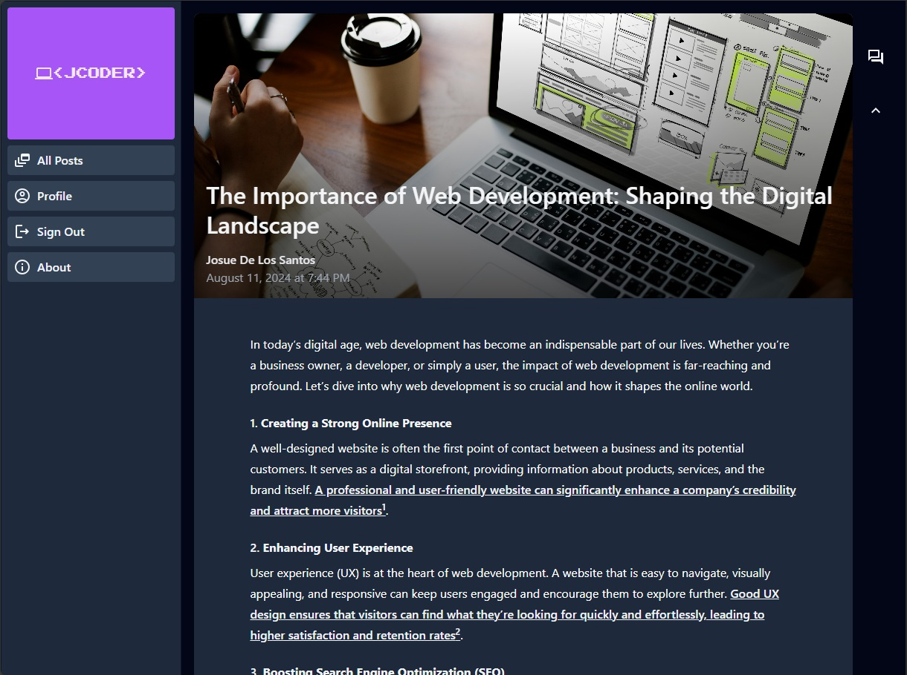
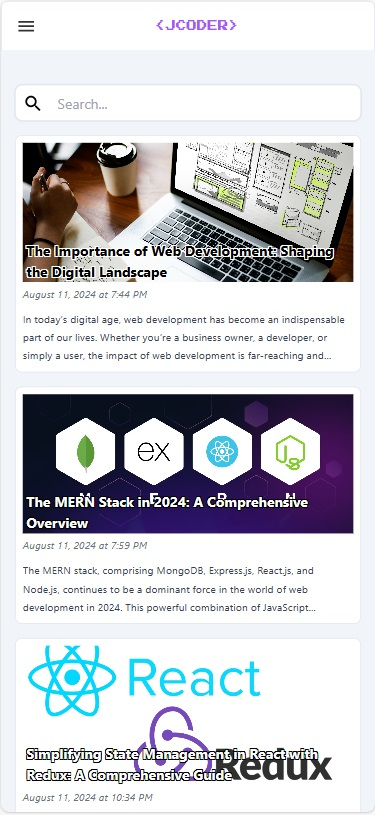
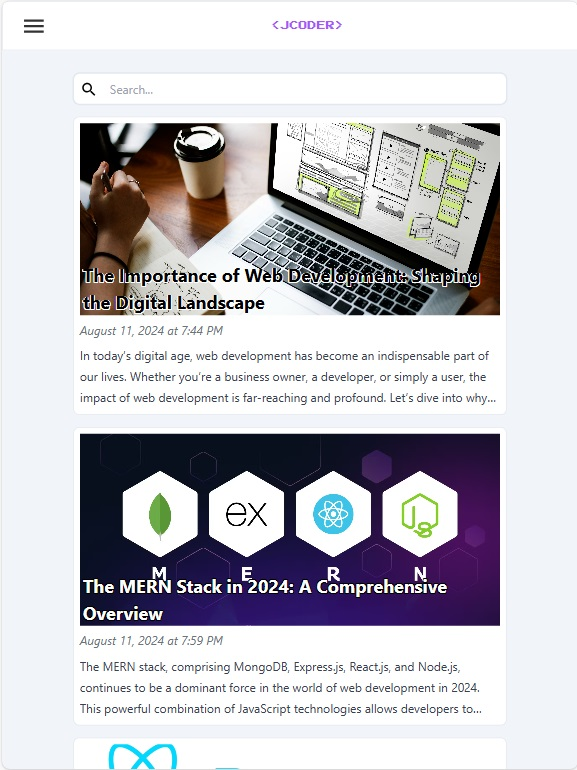

# Blog API Admin Page

This repository contains the [users page](https://blog-api-users-page.vercel.app/) for the JCODER blog, built using the following technologies:

<div style="display:flex;">
  
  
  
  
  
  
   
   
   
</div>

## Features

- **User Authentication**: Sign up and log in pages with secure authentication.
<div style="display: flex;">
  &nbsp;&nbsp;&nbsp; 
  
</div>

- **Comments Management**: Create, update, and delete comments.
  <div>
    
    
  </div>

- **Dark Mode**: Automatic dark mode styles for a better user experience.
<div styles="display: flex;">
  &nbsp;&nbsp;&nbsp;
  &nbsp;&nbsp;&nbsp;
  
</div>

- **Responsive Design**: Optimized for various screen sizes.
<div styles="display: flex;">
  &nbsp;&nbsp;&nbsp;
  &nbsp;&nbsp;&nbsp;
  
</div>

## Getting Started

### Prerequisites

- Node.js
- npm or yarn

### Installation

1. Clone the repository:
   ```bash
   git clone https://github.com/JosueDeLosSantos/blog-api-users-page.git
   ```
2. Navigate to the project directory:
   ```bash
   cd blog-api-users-page
   ```
3. Install dependencies:
   ```bash
   npm install
   ```

### Running the Application

1. Start the development server:
   ```bash
   npm run dev
   ```
2. Open your browser and navigate to `http://localhost:5173`.

## Deployment

This project is configured for deployment on Vercel. To deploy, follow these steps:

1. Install Vercel CLI:
   ```bash
   npm install -g vercel
   ```
2. Deploy the application:
   ```bash
   vercel
   ```

## Contributing

Contributions are welcome! Please fork the repository and create a pull request with your changes.
